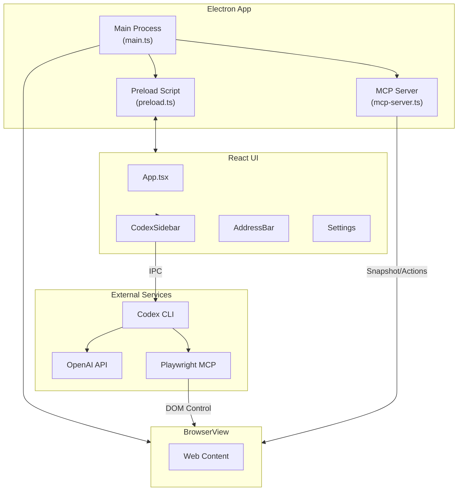

# GnuNae

An Electron-based browser with an AI-powered Codex sidebar for intelligent web automation.

🌐 **Website:** [www.gnunae.com](https://www.gnunae.com?utm_source=github)

> ⚠️ **Alpha Warning**: This app is still in alpha stage. Do not use it in production or with sensitive data.

## Architecture



### Component Overview

| Component | Description |
|-----------|-------------|
| **Main Process** | Electron main, window management, IPC handlers |
| **BrowserView** | Chromium-based web content rendering |
| **React UI** | Sidebar, address bar, settings overlay |
| **Codex CLI** | OpenAI's CLI for AI-powered automation |
| **MCP Server** | Model Context Protocol for browser control |
| **Playwright MCP** | DOM interaction and page automation |

## Features

- 🌐 **Full Browser** - Chrome-based web browser with address bar and navigation
- 🤖 **Codex Sidebar** - AI assistant powered by OpenAI's Codex CLI
- 🔐 **OpenAI Auth** - Sign in with your OpenAI account
- 🔧 **Page Analysis** - Codex can see and analyze your current page
- 🎯 **MCP Integration** - Model Context Protocol for browser control
- 💾 **Personal Data Store (PDS)** - Persistent storage for user data that Codex can access and update

## Demo Videos

### Use Case 1: Page Analysis

https://www.gnunae.com/assets/GnuNae.UseCase.1.mp4

### Use Case 2: Browser Automation

https://www.gnunae.com/assets/GnuNae.UseCase.2.mp4

## Installation

### Prerequisites
- Node.js 18+
- npm or yarn
- **ChatGPT Pro or Plus subscription** (required for Codex CLI)
  - Free ChatGPT accounts cannot use Codex features
  - Upgrade at: https://chat.openai.com/settings/subscription

### Setup

```bash
# Clone the repository
git clone https://github.com/fkiller/GnuNae.git
cd GnuNae

# Install dependencies
npm install

# IMPORTANT: Authenticate with OpenAI (first-time only)
npx codex auth openai

# Build the application
npm run build

# Run in development
npm run start
```

> ⚠️ **First-time users**: You must run `npx codex auth openai` to authenticate with OpenAI before using the app. This is a one-time setup.

## Usage

1. **Launch the app** - A browser window opens with a sidebar
2. **Sign in** - Click "Sign in to OpenAI" in the sidebar
3. **Navigate** - Use the address bar to visit any website
4. **Ask Codex** - Type a prompt in the sidebar (e.g., "list all links on this page")
5. **Get results** - Codex analyzes the page and responds

### Example Prompts
- "Summarize this page"
- "Find all job listings mentioning Python"
- "What are the main topics covered here?"
- "Google my address" (Codex will ask for your address and remember it)
- "Store all property information" (Codex extracts and saves data from the page)

### Personal Data Store (PDS)

The PDS allows Codex to remember your personal information across sessions:

1. **Automatic Prompting** - When Codex needs info (email, address, etc.), a smart card appears for you to enter it
2. **Persistent Storage** - Data is saved to `~/.gnunae/datastore.json` and reused automatically
3. **Web Extraction** - Ask Codex to "store" information from pages (e.g., property details from Zillow)
4. **Manage in Settings** - View, edit, or delete stored data in the Settings panel

Example workflow:
```
You: "Search my address on Zillow"
Codex: [Shows smart card asking for address]
You: [Enter "123 Main St, Boston MA"]
Codex: [Searches Zillow, saves address for future use]
```

### Prompt Architecture

When you send a prompt, GnuNae constructs the full prompt in this order:

| Order | Component | Description |
|-------|-----------|-------------|
| 1 | **Mode Instructions** | Behavior constraints based on mode (Ask/Agent/Full Access) |
| 2 | **Pre-Prompt** | System instructions from Settings |
| 3 | **User Data Context** | Personal data from the Data Store |
| 4 | **Page Context** | Current URL, title, and page content |
| 5 | **User Prompt** | Your actual request |

**Mode behaviors:**

| Mode | Behavior |
|------|----------|
| 💬 **Ask** | Read-only - can only describe page, refuses to click/submit/navigate |
| 🤖 **Agent** | Confirms critical actions (payments, final submissions, account changes) |
| ⚡ **Full Access** | 100% autonomous - no confirmations needed |

## Building for Distribution

```bash
# macOS
npm run pack:mac

# Windows
npm run pack:win

# Linux
npm run pack:linux
```

## Configuration

Codex settings are stored in `~/.codex/config.toml`:

```toml
model = "gpt-5.1-codex-max"
model_reasoning_effort = "xhigh"

[mcp_servers.browser]
command = "node"
args = ["/path/to/scripts/mcp-server.cjs"]
```

## Project Structure

```
src/
├── electron/              # Main process
│   ├── main.ts           # App entry, window management, IPC handlers
│   ├── preload.ts        # Context bridge for renderer
│   └── mcp-server.ts     # MCP server for browser control
├── ui/                   # Renderer process (React)
│   ├── index.tsx         # React entry point
│   ├── App.tsx           # Main UI layout
│   ├── App.css           # Global styles
│   └── components/
│       ├── AddressBar.tsx      # URL navigation bar
│       ├── CodexSidebar.tsx    # AI assistant sidebar
│       ├── DataRequestCard.tsx # Smart card for PDS data requests
│       ├── Settings.tsx        # Settings panel (includes PDS editor)
│       └── About.tsx           # About dialog
└── core/                   # Shared utilities
    ├── auth.ts             # OpenAI authentication
    ├── datastore.ts        # Personal Data Store service
    ├── settings.ts         # App settings & pre-prompt
    ├── schema.ts           # Type definitions
    └── vault.ts            # Secure storage

docs/                     # GitHub Pages (gnunae.com)
├── index.html            # Landing page
├── CNAME                 # Custom domain
└── assets/               # Logo, videos

.github/workflows/
└── release.yml           # CI/CD for multi-platform builds
```

## Tech Stack

- **Electron** - Desktop app framework
- **React** - UI library
- **TypeScript** - Type safety
- **Vite** - Build tool
- **OpenAI Codex** - AI code assistant

## Roadmap

| Status | Feature |
|--------|---------|
| ✅ Done | Electron-based browser integrated with Codex-Playwright MCP |
| ✅ Done | Personal Data Store (PDS) - persistent storage with smart card UI |
| ✅ Done | Two-way PDS integration - Codex can request AND store data |
| 🔜 Planned | More browser features (bookmarks, history, tabs) |
| 🔜 Planned | Edge/Chrome extension mode with GnuNae sidebar/backend |
| 🔜 Planned | Project management for multi-page workflows |
| 🔜 Planned | More LLM options including local LLM support |

## License

MIT

## Contributing

Contributions welcome! Please open an issue or PR.

---

Built with ❤️ for AI-powered browsing
