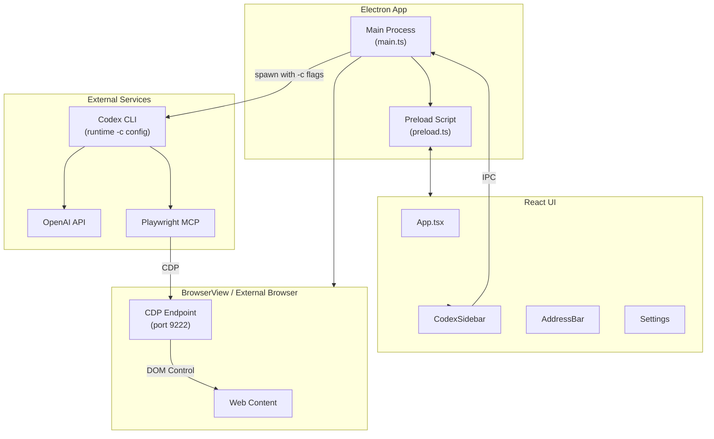

# GnuNae

An Electron-based browser with an AI-powered Codex sidebar for intelligent web automation.

🌐 **Website:** [www.gnunae.com](https://www.gnunae.com?utm_source=github) | 📺 **YouTube:** [@GnuNae](https://www.youtube.com/@GnuNae)

<a href="https://www.producthunt.com/products/gnunae?embed=true&utm_source=badge-featured&utm_medium=badge&utm_campaign=badge-gnunae" target="_blank"></a>

> ⚠️ **Alpha Warning**: This app is still in alpha stage. Do not use it in production or with sensitive data.

## Architecture



### Component Overview

| Component | Description |
|-----------|-------------|
| **Main Process** | Electron main, window management, IPC handlers, Codex spawning with `-c` flags |
| **BrowserView** | Chromium-based web content rendering with CDP endpoint |
| **React UI** | Sidebar, address bar, settings overlay |
| **Codex CLI** | OpenAI's CLI for AI-powered automation (configured at runtime) |
| **Playwright MCP** | DOM interaction via Chrome DevTools Protocol (CDP) |

## Features

- 🌐 **Full Browser** - Chrome-based web browser with address bar and navigation
- 🪟 **Multi-Window** - Open multiple independent windows (Cmd/Ctrl+N)
- 📑 **Multi-Tab** - Multiple tabs per window with tab bar
- 💬 **Chat Mode** - Sidebar-only mode for use with external browsers (Chrome, Edge, etc.)
- 🔗 **External Browser Support** - Connect Codex to your existing browser with full automation
- 🤖 **Codex Sidebar** - AI assistant powered by OpenAI's Codex CLI
- 🐳 **Virtual Mode** - Docker-based sandbox for isolated Codex + Playwright execution
- 📋 **Task Manager** - Save, schedule, and run automated tasks
- 🔐 **OpenAI Auth** - Sign in with your OpenAI account
- 🔧 **Page Analysis** - Codex can see and analyze your current page
- 🎯 **MCP Integration** - Model Context Protocol for browser control
- 💾 **Personal Data Store (PDS)** - Persistent storage for user data that Codex can access and update
- ⏰ **Scheduled Tasks** - Run tasks hourly, daily, or weekly at specific times
- ⚠️ **Failure Detection** - Automatic detection of CAPTCHA, 2FA, and login blocks

## Demo Videos

### Use Case 1: AI Web Automation

[](https://youtu.be/VwOk1_vD3vw)

### Use Case 2: Smart Page Analysis

[](https://youtu.be/QGOXpMclgbo)

### Use Case 3: Task Scheduling

[](https://youtu.be/cvK_fsA4cpk)

### Use Case 4: External Browser Support (v0.7.0)

[](https://youtube.com/shorts/1Wq6yL3nQ_w)

## Installation

### Prerequisites
- Node.js 18+
- npm or yarn
- **ChatGPT Pro or Plus subscription** (required for Codex CLI)
  - Free ChatGPT accounts cannot use Codex features
  - Upgrade at: https://chat.openai.com/settings/subscription

### Setup

```bash
# Clone the repository
git clone https://github.com/fkiller/GnuNae.git
cd GnuNae

# Install dependencies
npm install

# IMPORTANT: Authenticate with OpenAI (first-time only)
npx codex auth openai

# Build the application
npm run build

# Run in development
npm run start
```

> ⚠️ **First-time users**: You must run `npx codex auth openai` to authenticate with OpenAI before using the app. This is a one-time setup.

### Virtual Mode (Docker)

To use Virtual Mode, you need Docker Desktop installed. This runs Codex and Playwright in an isolated container.

```bash
# Build the Docker sandbox image
npm run build:docker

# Or build without cache (recommended after updates)
npm run build:docker:clean

# Build everything (app + Docker image)
npm run build:all
```

| Script | Description |
|--------|-------------|
| `build:docker` | Build the Docker sandbox image |
| `build:docker:clean` | Build Docker image without cache |
| `build:all` | Build app + Docker image |

Once built, enable Virtual Mode in Settings when Docker is detected.

## External Browsers & Chat Mode

GnuNae can now control your existing external browsers (Chrome, Edge, Brave, Opera) instead of using the built-in window.

1. **Manage Browsers**: Go to Settings → External Browsers to scan for installed browsers.
2. **Create Shortcuts**: Generate special shortcuts that launch your browser connected to GnuNae.
3. **Chat Mode**: Launching via shortcut opens GnuNae in "Chat Mode" - a floating sidebar that attaches to your external browser.
4. **Full Automation**: Codex can read, analyze, and control the external browser just like the built-in one.

## Usage

1. **Launch the app** - A browser window opens with a sidebar
2. **Sign in** - Click "Sign in to OpenAI" in the sidebar
3. **Navigate** - Use the address bar to visit any website
4. **Ask Codex** - Type a prompt in the sidebar (e.g., "list all links on this page")
5. **Get results** - Codex analyzes the page and responds

### Example Prompts
- "Summarize this page"
- "Find all job listings mentioning Python"
- "What are the main topics covered here?"
- "Google my address" (Codex will ask for your address and remember it)
- "Store all property information" (Codex extracts and saves data from the page)

### Personal Data Store (PDS)

The PDS allows Codex to remember your personal information across sessions:

1. **Automatic Prompting** - When Codex needs info (email, address, etc.), a smart card appears for you to enter it
2. **Persistent Storage** - Data is saved to `~/.gnunae/datastore.json` and reused automatically
3. **Web Extraction** - Ask Codex to "store" information from pages (e.g., property details from Zillow)
4. **Manage in Settings** - View, edit, or delete stored data in the Settings panel

Example workflow:
```
You: "Search my address on Zillow"
Codex: [Shows smart card asking for address]
You: [Enter "123 Main St, Boston MA"]
Codex: [Searches Zillow, saves address for future use]
```

### Prompt Architecture

When you send a prompt, GnuNae constructs the full prompt in this order:

| Order | Component | Description |
|-------|-----------|-------------|
| 1 | **Mode Instructions** | Behavior constraints based on mode (Ask/Agent/Full Access) |
| 2 | **Pre-Prompt** | System instructions from Settings |
| 3 | **User Data Context** | Personal data from the Data Store |
| 4 | **Page Context** | Current URL, title, and page content |
| 5 | **User Prompt** | Your actual request |

**Mode behaviors:**

| Mode | Behavior |
|------|----------|
| 💬 **Ask** | Read-only - can only describe page, refuses to click/submit/navigate |
| 🤖 **Agent** | Confirms critical actions (payments, final submissions, account changes) |
| ⚡ **Full Access** | 100% autonomous - no confirmations needed |

## Building for Distribution

```bash
# macOS
npm run pack:mac

# Windows
npm run pack:win

# Linux
npm run pack:linux
```

## Configuration

GnuNae configures Codex CLI automatically at runtime via `-c` flags. **No manual configuration needed** - GnuNae works out of the box without modifying `~/.codex/config.toml`.

If you have custom settings in `~/.codex/config.toml`, GnuNae will override them with:
- Model: `gpt-5.1-codex-max`
- Reasoning: `xhigh`
- Playwright MCP with dynamic CDP endpoint

## Project Structure

```
src/
├── electron/              # Main process
│   ├── main.ts           # App entry, window management, IPC handlers, Codex spawning
│   └── preload.ts        # Context bridge for renderer
├── ui/                   # Renderer process (React)
│   ├── index.tsx         # React entry point
│   ├── App.tsx           # Main UI layout
│   ├── App.css           # Global styles
│   └── components/
│       ├── AddressBar.tsx      # URL navigation bar
│       ├── CodexSidebar.tsx    # AI assistant sidebar
│       ├── DataRequestCard.tsx # Smart card for PDS data requests
│       ├── TaskManager.tsx     # Task Manager panel
│       ├── RightPanel.tsx      # Chat/Task Manager wrapper
│       ├── SaveTaskCard.tsx    # Save task prompt card
│       ├── TabBar.tsx          # Multi-tab bar
│       ├── Settings.tsx        # Settings panel (includes PDS editor)
│       └── About.tsx           # About dialog
└── core/                   # Shared utilities
    ├── auth.ts             # OpenAI authentication
    ├── browser-detector.ts # External browser detection (Chrome, Edge, etc.)
    ├── datastore.ts        # Personal Data Store service
    ├── tasks.ts            # Task service and scheduler
    ├── settings.ts         # App settings & pre-prompt
    ├── schema.ts           # Type definitions
    ├── docker-manager.ts   # Docker sandbox lifecycle management
    └── vault.ts            # Secure storage

docker/                   # Virtual Mode sandbox
├── Dockerfile            # Container image definition
├── entrypoint.sh         # Container startup script
├── api-server.js         # REST API for Codex execution
└── playwright.config.ts  # Playwright MCP configuration

docs/                     # GitHub Pages (gnunae.com)
├── index.html            # Landing page
├── CNAME                 # Custom domain
└── assets/               # Logo, videos

.github/workflows/
└── release.yml           # CI/CD for multi-platform builds
```

## Tech Stack

- **Electron** - Desktop app framework
- **React** - UI library
- **TypeScript** - Type safety
- **Vite** - Build tool
- **OpenAI Codex** - AI code assistant

## Roadmap

| Status | Feature |
|--------|---------|
| ✅ Done | Electron-based browser integrated with Codex-Playwright MCP |
| ✅ Done | Multi-window support with isolated Codex sessions |
| ✅ Done | Multi-tab support with tab bar |
| ✅ Done | Personal Data Store (PDS) - persistent storage with smart card UI |
| ✅ Done | Two-way PDS integration - Codex can request AND store data |
| ✅ Done | Task Manager - save, schedule, and automate tasks |
| ✅ Done | Virtual Mode - Docker sandbox for Codex + Playwright isolation |
| ✅ Done | External Browser Support (Chrome, Edge, Brave, Opera) |
| ✅ Done | Chat Mode (Sidebar-only window) |
| 🔜 Planned | Remote backend (home server, cloud) with VNC streaming |
| 🔜 Planned | Project management for multi-page workflows |
| 🔜 Planned | More LLM options including local LLM support |

## Version History

### v0.7.1 (2026-01-11)
- **Embedded Node.js & Codex CLI**
  - Windows: Node.js 22 LTS and Codex CLI bundled in package
  - macOS: Downloads Node.js and Codex to ~/Library/Application Support/GnuNae on first run
  - Settings UI shows runtime status (Node.js, npm, Codex CLI versions) under Native Mode
- **Downgraded electron-builder** to 24.13.3 for compatibility

### v0.7.0 (2026-01-10)
- **Cross-Platform Runtime Scripts**
  - Added `scripts/download-node.js` for portable Node.js download
  - Added `scripts/install-codex.js` for local Codex CLI installation
  - RuntimeManager service for validation and path resolution
- **GitHub Actions** updated for Windows builds with embedded runtime

### v0.6.1 (2026-01-06)
- **Chat Mode & External Browsers**
  - **Support for External Browsers**: Use Chrome, Edge, Brave, or Opera with GnuNae.
  - **Chat Mode Window**: Minimized sidebar-only interface when using external browsers.
  - **CDP Integration**: Real-time two-way control of external browsers via Chrome DevTools Protocol.
  - **Docker & Chat Mode**: Fixed complex CDP connection issues allowing Dockerized Codex to control external browsers via `host.docker.internal`.
  - **Standalone Settings**: Settings now open in a dedicated window in Chat Mode.
  - **Shortcuts**: Auto-generate shortcuts for your installed browsers with GnuNae integration.

### v0.6.0 (2026-01-04)
- **Virtual Mode (Docker Sandbox)**
  - Enables isolated execution of Codex CLI and Playwright MCP in a Docker container
  - Requires Docker Desktop installed on your machine
  - Shares OpenAI authentication with the container securely
  - Mounts working directory so attached files are accessible
  - Foundation for future remote backend support (home server, cloud)
  - Toggle via Settings panel when Docker is detected

### v0.5.3 - v0.5.1 (2025-12-28 - 2025-12-27)
- Bug fixes and stability improvements for multi-window support

### v0.5.0 (2025-12-27)
- **Multi-Window Support**
  - Open multiple independent GnuNae windows (Cmd/Ctrl+N)
  - Each window has isolated Codex sessions and working directory
  - Window-specific tab management and automation
  - Playwright MCP correctly targets each window's webview
- **Stability Improvements**
  - Fixed iframe navigation polluting address bar URL
  - Protected application UI from accidental Playwright navigation
  - Improved tab selection guidance in pre-prompt

### v0.4.4 - v0.4.1 (2025-12-24 - 2025-12-21)
- Bug fixes for task execution and UI improvements

### v0.4.0 (2025-12-21)
- **Task Execution System**
  - Save prompts as reusable tasks with one-time, on-going, or scheduled triggers
  - Task Manager panel with favorites, running tasks, and scheduled countdowns
  - Background scheduler for automated task execution
  - Max concurrency setting (1-5 simultaneous tasks)
- **Failure Handling**
  - CAPTCHA/2FA/login detection with warning cards
- **Menu Enhancements**
  - Settings accessible from App menu (⌘,)
  - View menu: Show Chat (⌘1), Task Manager (⌘2), Hide Panel (⌘0)
  - About dialog with open source library attributions
- **UI Improvements**
  - Chat/Task Manager toggle buttons in address bar
  - Collapsible right panel with dynamic browser resizing

### v0.2.0 (2024-12-17)
- Personal Data Store (PDS) with smart card UI
- Multi-tab browser support

### v0.1.0 (2024-12-01)
- Initial release
- Codex sidebar with OpenAI integration
- MCP-based browser automation

## License

MIT

## Contributing

Contributions welcome! Please open an issue or PR.

---

Built with ❤️ for AI-powered browsing
